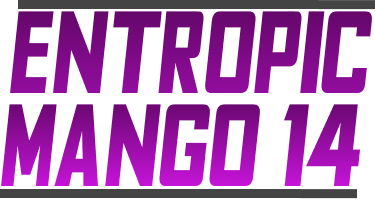

<div align="center">
  
</div>

Entropic Mango 14 is fork of [Space Station 14](https://github.com/space-wizards/space-station-14) written in C#
## Links

<div class="header" align="center">

[Website](https://spacestation14.com/) | [Discord](https://discord.ss14.io/) | [Forum](https://forum.spacestation14.com/) | [Mastodon](https://mastodon.gamedev.place/@spacestation14) | [Lemmy](https://lemmy.spacestation14.com/) | [Patreon](https://www.patreon.com/spacestation14) | [Steam](https://store.steampowered.com/app/1255460/Space_Station_14/) | [Standalone Download](https://spacestation14.com/about/nightlies/)

</div>

## Documentation/Wiki

[Wizards docs site](https://docs.spacestation14.com/)

## Contributing

later...

## Building

1. Clone this repo:
```shell
git clone https://github.com/ArZarLordOfMango/entropic-mango-14
```
2. Go to the project folder and run `RUN_THIS.py` to initialize the submodules and load the engine:
```shell
cd entropic-mango-14
python RUN_THIS.py
```
3. Compile the solution:

Build the server using `dotnet build`.

[More detailed instructions on building the project.](https://docs.spacestation14.com/en/general-development/setup.html)

## License

All code for the content repository is licensed under the [MIT license](https://github.com/space-wizards/space-station-14/blob/master/LICENSE.TXT).

For assets please see meta.json or attributions.yml for specific attribution and licensing details.
